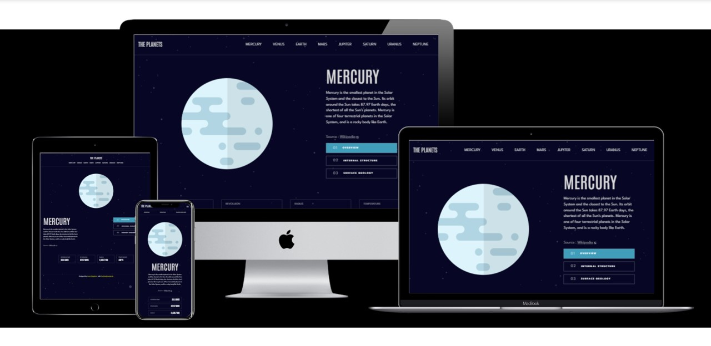

# Frontend Mentor - Planet Facts Solution

This is a solution to the [Planet Facts challenge on Frontend Mentor](https://www.frontendmentor.io/challenges/planets-fact-site-gazqN8w_f). Frontend Mentor challenges help you improve your coding skills by building realistic projects. 

## Table of contents

- [The challenge](#the-challenge)
- [Screenshot](#screenshot)
- [Links](#links)
- [Built with](#built-with)
- [Author](#author)

### The challenge

Users should be able to:

- View the optimal layout for the app depending on their device's screen size
- See hover states for all interactive elements on the page
- View each planet page and toggle between "Overview", "Internal Structure", and "Surface Geology"

### Screenshot

### Links

- Solution URL: [Github Repository](https://github.com/leonp84/fm10-planet-facts)
- Live Site URL: [Planet Facts](https://leonp84.github.io/fm10-planet-facts/)

### Built with

- Semantic HTML5 markup
- CSS custom properties
- Flexbox
- Mobile-first workflow
- [React](https://reactjs.org/) - JS library

## Author

- Github - [Leon Potgieter](https://github.com/leonp84)
- Frontend Mentor - [@leonp84](https://www.frontendmentor.io/profile/leonp84)

## Acknowledgments

[react.dev](https://react.dev/learn) is a great resource for learning the framework! I found it very helpful and user friendly.